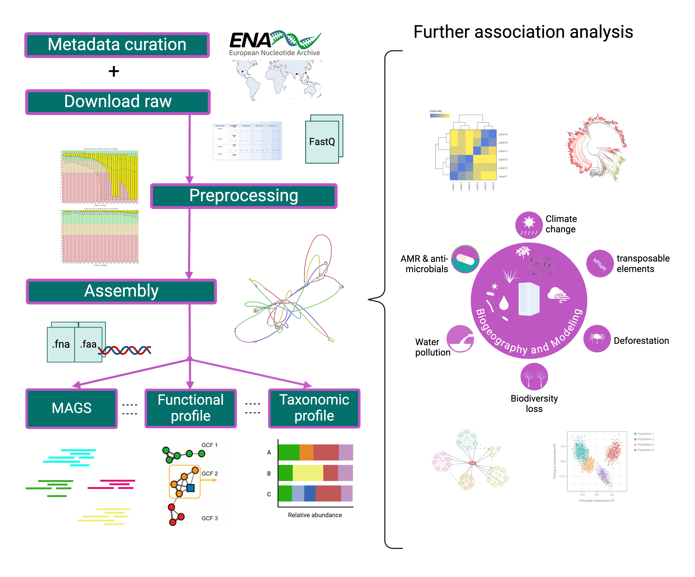
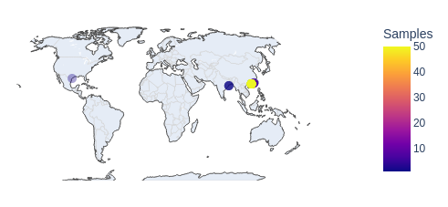

# Magenta

<div align="right"> 
  
<br><br>
### An Integrated and Systematically-Processed _Bioinformatics Tool_ for Microbial Gene Research in Mangrove Ecosystems Worldwide
<br><br>

</div>

<div align="right">

**Institution:**  
Institute of Marine Sciences and Limnology (UNAM)  

**Team Members:**  
Dr. Mirna Vázquez Rosas Landa  
Dr. Rosela Yazmín Pérez Ceballos  
Dr. Nelly Selem Mojica  
Erika A. Castañeda López  
Andrés Arredondo Cruz

</div>
<br><br>

---
<div align="justify">

Mangroves are recognized as vital reserves of biological diversity and highly productive ecosystems. Numerous worldwide metagenomic studies have highlighted the mangrove microbial community as a crucial component of biogeochemical cycles, including photosynthesis, nitrogen fixation, sulfur reduction, and particularly carbon transformation, whose understanding is essential for addressing significant ecological challenges such as climate change. However, there is currently a lack of computational tools that enable the analysis of these processes and relationships on a global scale.

MAGENTA (Global Mangrove Gene Catalogue) aims to serve as a critical bioinformatics tool designed to provide quantitative information on global shotgun metagenomics of mangrove microbiomes, whose purpose is to formulate new hypotheses regarding the abundance, distribution, and metabolic functions of microorganisms within the mangrove ecosystem, thereby enhancing our understanding of these complex global systems.

</div>

---

<br><br>

<p align="center">
  
</p>

<br><br>
## Unique and Non-redundat Global Gene Catalogue

<div align="justify">

MAGENTA includes an integrated and consistently processed catalog of microbial genes from mangrove ecosystems, serving as a global repository of unique and non-redundant genes at the species-level identity threshold. It leverages publicly available data from specialized databases, including whole-genome shotgun (WGS) metagenomes from five key habitats of the mangrove microbial community—rhizosphere, seawater, sediment, soil, and wetland— alongside metagenomes collected by our research team from local mangrove environments in Mexico (e.g. Tuxpan, Cd. del Carmen, Cozumel). This comprehensive approach provides critical insights into local microbial communities, significantly enhancing our understanding of global microbial diversity and the ecological roles these microorganisms play within these vital ecosystems.

</div>


## Geography

We collected publicly available mangrove metagenome datasets from the European Nucleotide Archive (ENA Portal API) to develop MAGENTA. Incomplete or inconsistent datasets were filtered out, resulting in a total of 71 pairs of sequencing files from 7 studies across 12 locations in three countries: China, India, and the United States. 

<div align="center">
  
[](https://andrespan.github.io/Magenta_map/)

</div>


<br><br>
```geojson
{
  "type": "FeatureCollection",
  "features": [
    {
      "type": "Feature",
      "properties": {},
      "geometry": {
        "coordinates": [
          113.63442525991314,
          22.437208163005323
        ],
        "type": "Point"
      }
    },
    {
      "type": "Feature",
      "properties": {},
      "geometry": {
        "coordinates": [
          116.59525498784558,
          23.266963987629524
        ],
        "type": "Point"
      }
    },
    {
      "type": "Feature",
      "properties": {},
      "geometry": {
        "coordinates": [
          117.11289861034885,
          23.565228585984926
        ],
        "type": "Point"
      }
    },
    {
      "type": "Feature",
      "properties": {},
      "geometry": {
        "coordinates": [
          86.84998677429826,
          20.652731968451093
        ],
        "type": "Point"
      }
    },
    {
      "type": "Feature",
      "properties": {},
      "geometry": {
        "coordinates": [
          86.87114310843344,
          20.732284593948222
        ],
        "type": "Point"
      }
    },
    {
      "type": "Feature",
      "properties": {},
      "geometry": {
        "coordinates": [
          -97.04115651070148,
          27.892539839075496
        ],
        "type": "Point"
      }
    },
    {
      "type": "Feature",
      "properties": {},
      "geometry": {
        "coordinates": [
          86.98612832767566,
          20.68458953524052
        ],
        "type": "Point"
      }
    },
    {
      "type": "Feature",
      "properties": {},
      "geometry": {
        "coordinates": [
          86.8585295369873,
          20.662497862444084
        ],
        "type": "Point"
      }
    },
    {
      "type": "Feature",
      "properties": {},
      "geometry": {
        "coordinates": [
          86.87177486047602,
          20.732239590837253
        ],
        "type": "Point"
      }
    },
    {
      "type": "Feature",
      "properties": {},
      "geometry": {
        "coordinates": [
          86.98723390138787,
          20.678808554548056
        ],
        "type": "Point"
      }
    },
    {
      "type": "Feature",
      "properties": {},
      "geometry": {
        "coordinates": [
          86.92980582827806,
          20.77499081322881
        ],
        "type": "Point"
      }
    },
    {
      "type": "Feature",
      "properties": {},
      "geometry": {
        "coordinates": [
          86.92784565928957,
          20.77572389943124
        ],
        "type": "Point"
      }
    }
  ]
}
```

```geojson
{
  "type": "FeatureCollection",
  "features": [
    {
      "type": "Feature",
      "properties": {
        "description": "Rhizosphere metagenome - China"
      },
      "geometry": {
        "type": "Point",
        "coordinates": [116.52, 23.27]
      }
    },
    {
      "type": "Feature",
      "properties": {
        "description": "Sediment metagenome - China: Pearl River Estuary"
      },
      "geometry": {
        "type": "Point",
        "coordinates": [113.64, 22.43]
      }
    },
    {
      "type": "Feature",
      "properties": {
        "description": "Soil metagenome - Brazil: Bahia"
      },
      "geometry": {
        "type": "Point",
        "coordinates": [-39.056139, -13.367918]
      }
    },
    {
      "type": "Feature",
      "properties": {
        "description": "Sediment metagenome - China: Yunxiao"
      },
      "geometry": {
        "type": "Point",
        "coordinates": [117.24, 23.55]
      }
    },
    {
      "type": "Feature",
      "properties": {
        "description": "Wetland metagenome - USA: Texas"
      },
      "geometry": {
        "type": "Point",
        "coordinates": [-97.0386, 27.8985]
      }
    },
    {
      "type": "Feature",
      "properties": {
        "description": "Soil metagenome - India: Bhitarkanika mangrove forest, Odisha"
      },
      "geometry": {
        "type": "Point",
        "coordinates": [86.8503, 20.6528]
      }
    }
  ]
}
```
