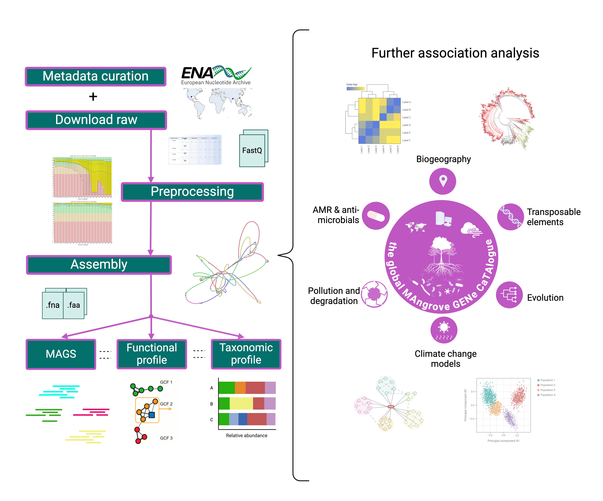

# Magenta

<div align="right"> 
  
<br><br>
### An Integrated and Systematically-Processed _Bioinformatic Tool_ for Microbial Gene Research in Mangrove Ecosystems Worldwide
<br><br>

</div>

<div align="right">

**Institution:**  
Institute of Marine Sciences and Limnology (UNAM)  

**Team Members:**  
Dr. Mirna Vázquez Rosas Landa  
Dr. Rosela Yazmín Pérez Ceballos  
Dr. Nelly Selem Mojica    
Pg, Ra. Andrés Arredondo Cruz
Stud, Ra. Erika A. Castañeda López

</div>
<br><br>

---
<div align="justify">

Mangroves are recognized as **crucial reservoirs of biological diversity** and **highly productive ecosystems**. Numerous global metagenomic studies have emphasized the importance of mangrove microbial communities as integral components of biogeochemical cycles, including photosynthesis, nitrogen fixation, sulfur reduction, and notably carbon transformation. Understanding these processes is essential for tackling significant ecological challenges, such as climate change. **However, there is currently a scarcity of computational tools that facilitate the analysis of these processes and relationships on a global scale**.

**MAGENTA** _(or Global Mangrove Gene Catalogue)_ is designed to be a vital **bioinformatic** resource that provides quantitative insights into global shotgun metagenomics of mangrove microbiomes. Its purpose is to generate new hypotheses regarding the abundance, distribution, and metabolic functions of microorganisms within the mangrove ecosystem, thereby deepening our understanding of these complex global systems.

</div>

---

<br><br>
## Unique and Non-redundat Global Gene Catalogue

<div align="justify">

**MAGENTA** encompasses an integrated and systematically processed catalog of microbial genes from mangrove ecosystems, functioning as a global repository of unique, non-redundant gene information. It utilizes publicly available data from specialized databases, including whole-genome shotgun (WGS) metagenomes from five key habitats of the mangrove microbial community —rhizosphere, seawater, sediment, soil, and wetland— alongside metagenomes collected by our research team from local mangrove environments in Mexico (e.g., Tuxpan, Cd. del Carmen, Cozumel). This comprehensive approach delivers critical insights into local microbial communities while significantly enhancing our understanding of global microbial diversity and the ecological roles these microorganisms play within these vital ecosystems.

</div>

<br><br>

<p align="center">
  
</p>

<br><br>

## Geography

**MAGENTA** leveraged publicly available metagenomic datasets of mangrove ecosystems sourced from the European Nucleotide Archive. In its analysis, **MAGENTA** systematically excluded incomplete or inconsistent datasets, resulting in **71** pairs of sequencing files derived from seven distinct studies, spanning 12 geographic locations across three countries: China, India, and the United States.

<br><br>

```geojson
{
  "type": "FeatureCollection",
  "features": [
    {
      "type": "Feature",
      "properties": {},
      "geometry": {
        "coordinates": [
          113.63442525991314,
          22.437208163005323
        ],
        "type": "Point"
      }
    },
    {
      "type": "Feature",
      "properties": {},
      "geometry": {
        "coordinates": [
          116.59525498784558,
          23.266963987629524
        ],
        "type": "Point"
      }
    },
    {
      "type": "Feature",
      "properties": {},
      "geometry": {
        "coordinates": [
          117.11289861034885,
          23.565228585984926
        ],
        "type": "Point"
      }
    },
    {
      "type": "Feature",
      "properties": {},
      "geometry": {
        "coordinates": [
          86.84998677429826,
          20.652731968451093
        ],
        "type": "Point"
      }
    },
    {
      "type": "Feature",
      "properties": {},
      "geometry": {
        "coordinates": [
          86.87114310843344,
          20.732284593948222
        ],
        "type": "Point"
      }
    },
    {
      "type": "Feature",
      "properties": {},
      "geometry": {
        "coordinates": [
          -97.04115651070148,
          27.892539839075496
        ],
        "type": "Point"
      }
    },
    {
      "type": "Feature",
      "properties": {},
      "geometry": {
        "coordinates": [
          86.98612832767566,
          20.68458953524052
        ],
        "type": "Point"
      }
    },
    {
      "type": "Feature",
      "properties": {},
      "geometry": {
        "coordinates": [
          86.8585295369873,
          20.662497862444084
        ],
        "type": "Point"
      }
    },
    {
      "type": "Feature",
      "properties": {},
      "geometry": {
        "coordinates": [
          86.87177486047602,
          20.732239590837253
        ],
        "type": "Point"
      }
    },
    {
      "type": "Feature",
      "properties": {},
      "geometry": {
        "coordinates": [
          86.98723390138787,
          20.678808554548056
        ],
        "type": "Point"
      }
    },
    {
      "type": "Feature",
      "properties": {},
      "geometry": {
        "coordinates": [
          86.92980582827806,
          20.77499081322881
        ],
        "type": "Point"
      }
    },
    {
      "type": "Feature",
      "properties": {},
      "geometry": {
        "coordinates": [
          86.92784565928957,
          20.77572389943124
        ],
        "type": "Point"
      }
    }
  ]
}
```
<br><br>
<br><br>
For more information:

_Link to the Interactive Magenta Datasets Map:_
<div align="center">
  
[](https://andrespan.github.io/Magenta_map/)

</div>


